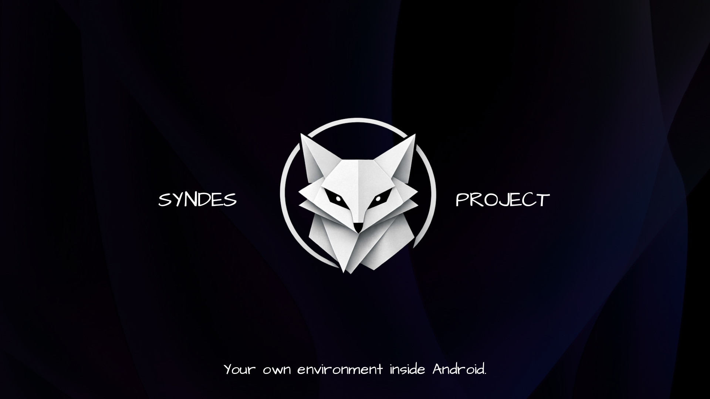

# Syndes-Project
### Lightweight modular work environment on top of Android

Works **without root and ADB**.
Inspired by: AROS, Plan 9, Arch Linux.

### Core ideas of the project

* Does not try to emulate Linux — it uses native Android APIs while providing a Linux-like experience.
* Minimal number of fixed components
* Everything else is just regular apps from app stores (F-Droid, Google Play, Izzy, etc.)

### What’s included in the project

* **Terminal** — an unconventional terminal that communicates with the system using Android APIs. Supports scripting.
* **Components** — a single APK containing many small activities (multiple small utilities bundled together).
* **Material Files** — a powerful file manager. Can be updated via **F-Droid**.
* **Kiss Launcher** — minimalistic, partially compatible with **Material Files** and **Terminal**.
* F-Droid / IzzyOnDroid (depending on user choice: web version or app) + a system-integrated app store (for example Google Play, if supported).

All other apps (browser, gallery, keyboard, etc.) are up to you — install whatever you like from app stores.

### Main principles

* Modularity and loose coupling. This allows maximum reuse of updates from third-party software, avoids monopolizing the environment, and ensures continuous patches for all apps (from their original developers).
* Fixed components are updated rarely and only when necessary.
* Saving storage space and nerves during installation and updates.
* Compatibility with modern Android versions (so it should remain usable for years).

### Compatibility

Android 14 and below — stable
Android 15 — also works, but has been tested less.

### Project status (2026)

A hobby project by a single person with the help of neural networks. Some parts of the code are a bit rough, documentation is not ready yet, but few bugs have been identified. Use at your own risk.

Want to contribute?
Pull requests, issues, and ideas are welcome.

Open-source project. Licensed under Apache 2.0
